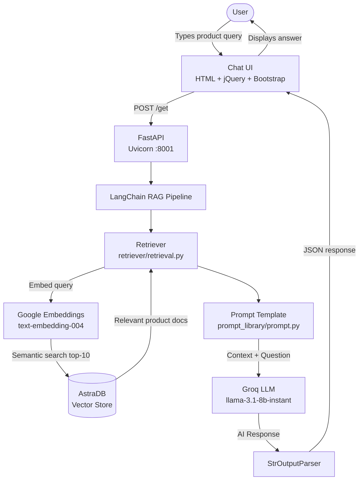
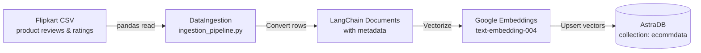
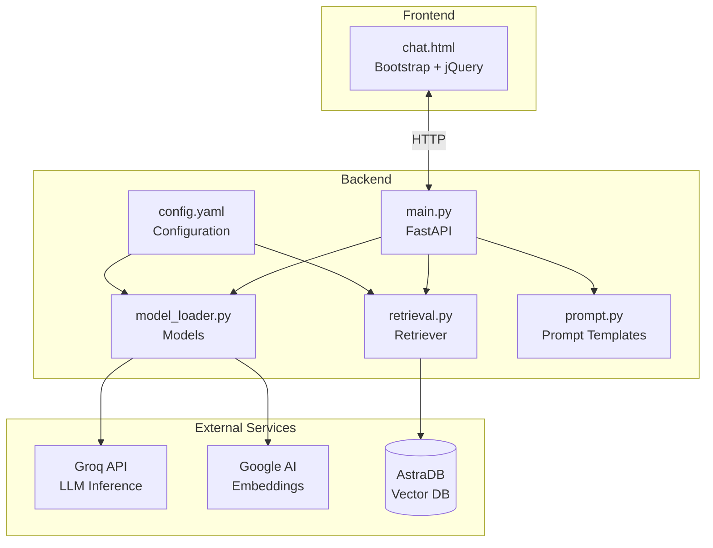

# Flipkart AI Customer Support System

## 1. Overview
An AI-powered e-commerce customer support chatbot that answers product queries using Retrieval-Augmented Generation (RAG). It scrapes Flipkart product data, stores embeddings in a vector database, and uses an LLM to provide contextual product recommendations and support responses based on real product reviews and ratings.

## 2. Tech Stack
- **FastAPI** — async REST API backend
- **Uvicorn** — ASGI server (port 8001)
- **LangChain** — RAG pipeline orchestration
- **Groq (llama-3.1-8b-instant)** — LLM inference
- **Google Generative AI (text-embedding-004)** — text embeddings
- **AstraDB (DataStax)** — vector database for semantic search
- **Jinja2 + Bootstrap + jQuery** — chat frontend
- **Python 3.10**

## 3. How It Works (Architecture)

### Query Flow (Runtime)



---

### Data Ingestion Pipeline (Run Once)



---

### Component Overview



## 4. Setup Steps

```bash
# 1. Clone the repo
git clone <repo-url>
cd Customer_Support_System

# 2. Create and activate conda environment
conda create -p env python=3.10 -y
conda activate ./env

# 3. Install dependencies
pip install -r requirements.txt

# 4. Configure environment variables
# Create a .env file with:
# GOOGLE_API_KEY=<your-key>
# GROQ_API_KEY=<your-key>
# ASTRA_DB_API_ENDPOINT=<your-endpoint>
# ASTRA_DB_APPLICATION_TOKEN=<your-token>
# ASTRA_DB_KEYSPACE=<your-keyspace>

# 5. Run data ingestion (first time only)
python data_ingestion/ingestion_pipeline.py

# 6. Start the server
uvicorn main:app --reload --port 8001
```

Open [http://localhost:8001](http://localhost:8001) in your browser.

## 5. Project Structure

```
Customer_Support_System/
├── main.py                          # FastAPI app entry point
├── config/config.yaml               # Model and DB configuration
├── retriever/retrieval.py           # AstraDB vector retriever
├── utils/model_loader.py            # Loads Groq LLM & Google embeddings
├── prompt_library/prompt.py         # RAG system prompt templates
├── data_ingestion/ingestion_pipeline.py  # CSV → AstraDB ingestion
├── data_collection_pipeline/        # Flipkart scraper
├── templates/chat.html              # Chat UI frontend
├── static/style.css                 # Chat UI styles
├── requirements.txt
└── .env                             # API keys (not committed)
```
